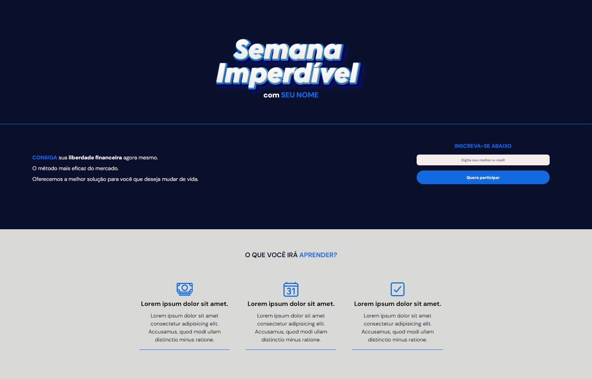

<h1 align="center"> Caputa de Clientes - Landing Page </h1>

Programa realizado para aprimoramento de conhecimentos em HTML e CSS  

  <a href="#-tecnologias">Tecnologias</a>&nbsp;&nbsp;&nbsp;|&nbsp;&nbsp;&nbsp;
  <a href="#-projeto">Projeto</a>&nbsp;&nbsp;&nbsp;|&nbsp;&nbsp;&nbsp;
  <a href="#memo-licença">Licença</a>

  

 

  

## 🚀 Tecnologias

Esse projeto foi desenvolvido com as seguintes tecnologias:

- HTML e CSS
- Git e Github

## 💻 Projeto

Projeto idealizado para a captura de clientes via e-mail..[]

- [Acesse o projeto finalizado, online](https://devgustavopassos.github.io/capture-page/)

## 🔒 Licença

Esse projeto está sob a licença MIT.

---

Feito com ♥ by Gustavo
